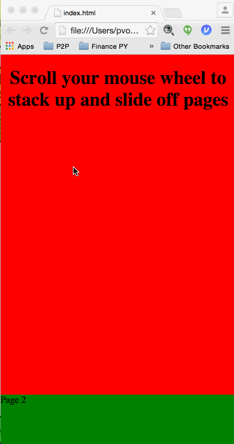

## A jQuery plugin for a scrolling stack of pages



## Usage

Include the **scroll-deck** plugin as well as its dependencies, **mouswheel**
and **jQuery** itself:

```
<script src="jquery-2.0.3.js"></script>
<script src="jquery.mousewheel.min.js"></script>
<script src="jquery.scroll-deck.js"></script>
```

Just add a class e.g., ```page```, to your ```div```s:

``` 
<body>
    <div class="page" style="background: red;">
        <h1 style="text-align: center;">Scroll your mouse wheel to stack up and slide off pages <h1>
    </div>
    <div class="page" style="background: green;">Page 2</div>
    <div class="page" style="background: blue;">Page 3</div>
</body>
```

Finally, invoke the plugin on your class when the page loads:


```
<script>
    $(function() {
        $('.page').scrolldeck();
    });             
</script>
```

